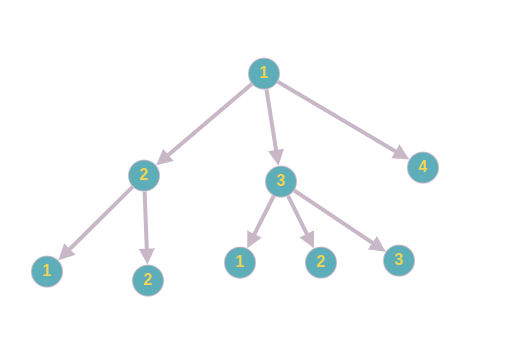

# Лабораторная работа №23

## Задание

Составить программу на языке Си для построения и обработки дерева общего вида или упорядоченного двоичного дерева, содержащего узлы типа float, int, char или enum (для групп 1,8; 3,4; 2,5; 6,7 соответственно). Основные функции работы с деревьями реализовать в виде универсальных процедур или функций. После того, как дерево создано, его обработка должна производиться в режиме текстового меню со следующими действиями:

1. *добавление нового узла* (для двоичного дерева положение нового узла определяется в соответствии с требованием сохранения порядка; для дерева общего вида должен задаваться *отец* добавляемого узла, добавленный узел становится *самым младшим сыном*);
2. *текстовая визуализация дерева* (значение каждого узла выводится в отдельной строке, с отступом, пропорциональным глубине узла, в порядке старшинства узлов);
3. *удаление узла* (двоичное дерево перестраивается в соответствии с требованием сохранения целостности и порядка; для дерева общего вида удаляется все поддерево, исходящее из удаляемого узла. Должно быть предусмотрено корректное освобождение памяти);
4. *вычисление функции от дерева* (целой или логической) в соответствии с номером вариант

## Формат ввода/вывода

### Бинарные деревья

#### Команды

```
a [Значение] - Добавление нового ключа в дерево
d [Значение] - Удаление ключа из дерева
p            - Печать дерева на экран
t            - Вычисление функции по варианту
```

Если вычисляемая функция логическая - программа в ответ на комманду *t* должна вывести *True* или *False*. Если же результатом является число, просто вывести само это число.

#### Пример сессии:

*Обратите внимание на то, как происходит печать дерева!*
```
-> binary_tree ./a.out
a 10
a 5
a 15
a 7
a 4
a 12
a 17
p
      17
  15
      12
10
       7
   5
       4
t
True
```

### Деревья общего вида

#### Команды

```
a [Путь] [Значение] - Добавление нового ключа в дерево
d [Путь]            - Удаление ключа из дерева
p                   - Печать дерева на экран
t                   - Вычисление функции по варианту
```
Путь представляет из себя строку строку состоящюю из символов ```r```, ```s``` и ```b```. 
Символ ```r``` означает начало пути, стоит всегда вначале и нигде больше не используется, ```s``` - переход к сыну, ```b``` - переход к брату.

#### Пример сессии

*Обратите внимание, какой путь указывается при вставке в пустое дерево и какой путь указывается при вставке, когда родителем является корень дерева.
 Так же рассмотрите пример печати дерева.*

```
a r 1
a r 2
a r 3
a r 4
a rs 1
a rs 2
a rsb 1
a rsb 2
a rsb 3
p
1
   2
       1
       2
   3
       1
       2
       3
   4
```

#### Дерево из примера:




## Варианты

B -- Бинарное дерево

N -- Дерево общего вида

1. \[B] Проверить, является ли двоичное дерево AVL-деревом.
2. \[B] Проверить, является ли двоичное дерево В-деревом.
3. \[N] Определить значение листа дерева, имеющего минимальную глубину.
4. \[B] Определить значение листа двоичного дерева, имеющего минимальную глубину.
5. \[N] Определить значение нетерминальной вершины дерева с максимальной глубиной.
6. \[B] Определить значение нетерминальной вершины двоичного дерева с максимальной глубиной.
7. \[B] Проверить, находятся ли во всех листьях двоичного дерева элементы со значениями в заданном диапазоне.
8. \[N] Определить число вершин дерева, степень которых совпадает со значением элемента.
9. \[B] Определить число вершин двоичного дерева, степень которых совпадает со значением элемента.
10. \[N] Проверить монотонность возрастания ширины уровня дерева.
11. \[N] Проверить монотонность убывания ширины уровня дерева.
12. \[B] Проверить, является ли двоичноe дeрeво линейным списком вершин.
13. \[N] Проверить, является ли дeрeво линейным списком вершин.
14.	\[N] Проверить, находятся ли всe листья дeрeва на одном уровне.
15.	\[B] Проверить, находятся ли все листья двоичного дерева на одном уровне.
16.	\[B] Проверить, является ли двоичноe дeрeво симметричным (равным своему отражению).
17.	\[B] Проверить, является ли двоичноe дeрeво самоподобным (подобным своему отражению).
18.	\[N] Определить ширину дeрeва.
19.	\[B] Определить ширину двоичного дерева.
20.	\[N] Определить глубину максимальной вершины дерева.
21.	\[B] Определить глубину минимальной вершины двоичного дерева.
22.	\[N] Определить число вершин дерева.
23.	\[B] Определить число вершин двоичного дерева.
24.	\[N] Определить глубину дерева.
25.	\[B] Определить глубину двоичного дерева.
26.	\[N] Определить степень дерева.
27.	\[B] Определить степень двоичного дерева
28.	\[N] Определить число листьев дерева.
29.	\[B] Определить число листьев двоичного дерева.
30.	\[N] Определить число нетерминальных вершин дерева.
31.	\[B] Определить число нетерминальных вершин двоичного дерева.
32.	\[N] Определить число вершин дерева степень которых совпадает со степенью дерева.
33.	\[B] Определить число вершин двоичного дерева имеющих ровно два поддерева.
34.	\[N] Определить уровень дерева, на котором находится максимальное число вершин.
35.	\[B] Определить уровень двоичного дерева, на котором находится максимальное число вершин.

## Как будет оцениваться работа

На итоговую оценку за лабораторную работу влияют следующие факторы:
1. Наличие тестов.
2. Отсутсвие багов (т.е. редко встречающиеся ошибки, влияющие на итоговый вывод программы).
3. Отсутсвие критических багов (т.е. вылеты программы, неправильный ответ программы на какие-то общие случаи и т.д.).
4. Отсутвие утечек памяти.
5. Наличие единого стиля кода (именование переменных, расстановка скобок и т.д., [см. пример](https://github.com/just3mhz/Labs1Course/blob/main/README.md#код-стайл)).

## Какие знания/умения должны быть получены после выполнения работы

1. Понимание того, как работают бинарные деревья и деревья общего вида.   
      - Добавление, удаление и поиск  
      - Сериализация/десериализация
      - Обходы деревьев
      - Построение дерева из массива
2. Умение реализовать на языке Си оьщие операции над деревьями.
3. Умение решать простейшие задачи над деревьями. 
4. Умение работать с динамической памятью


